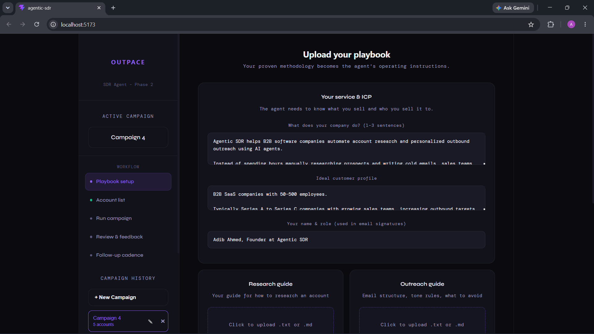
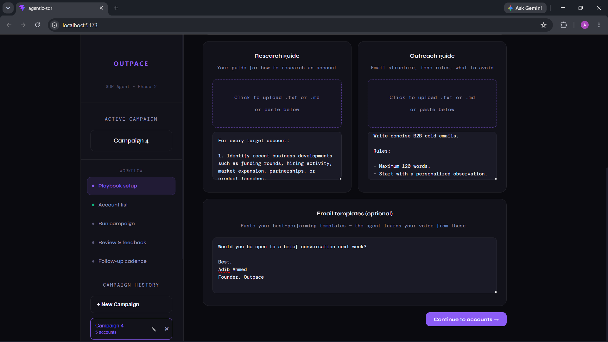
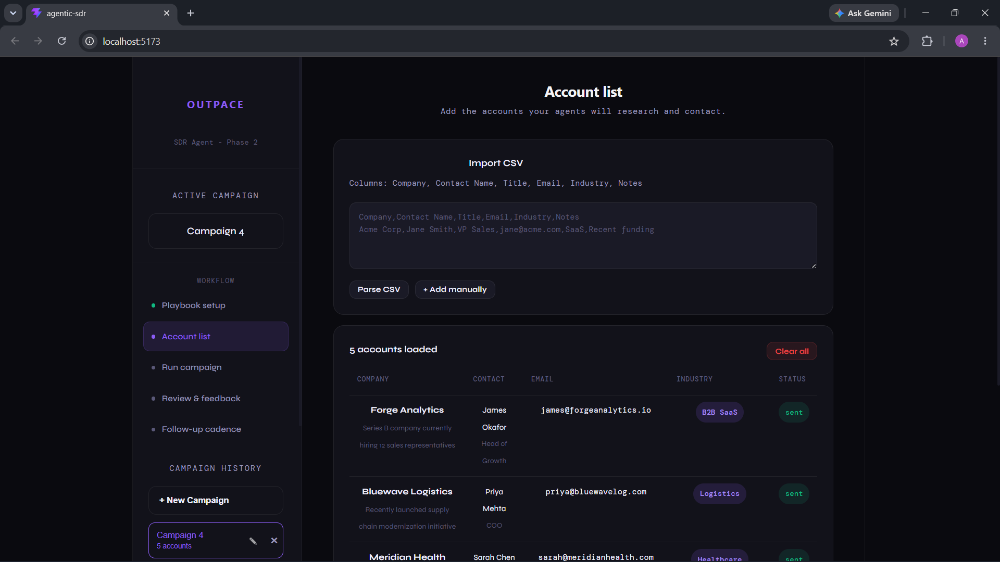
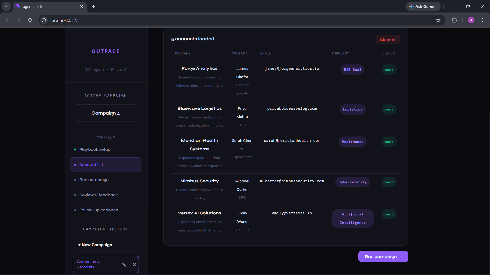
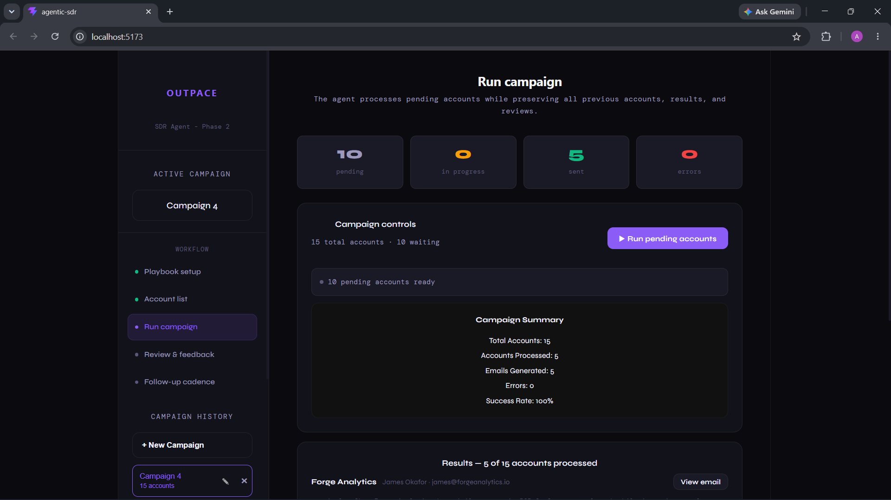
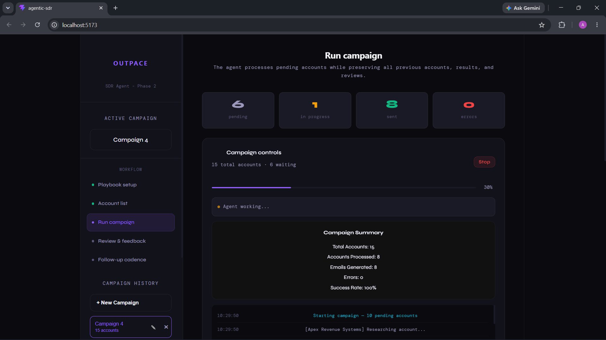
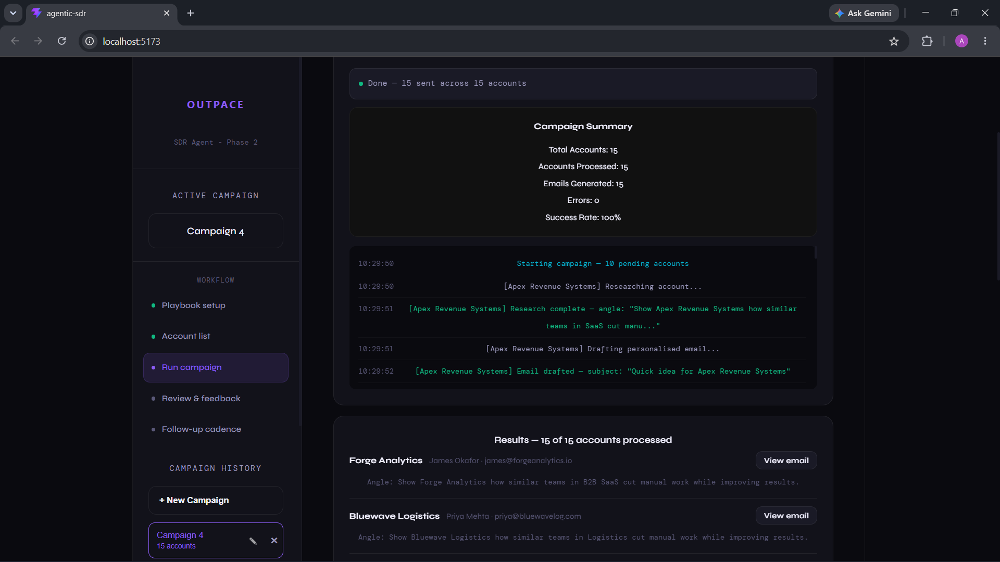
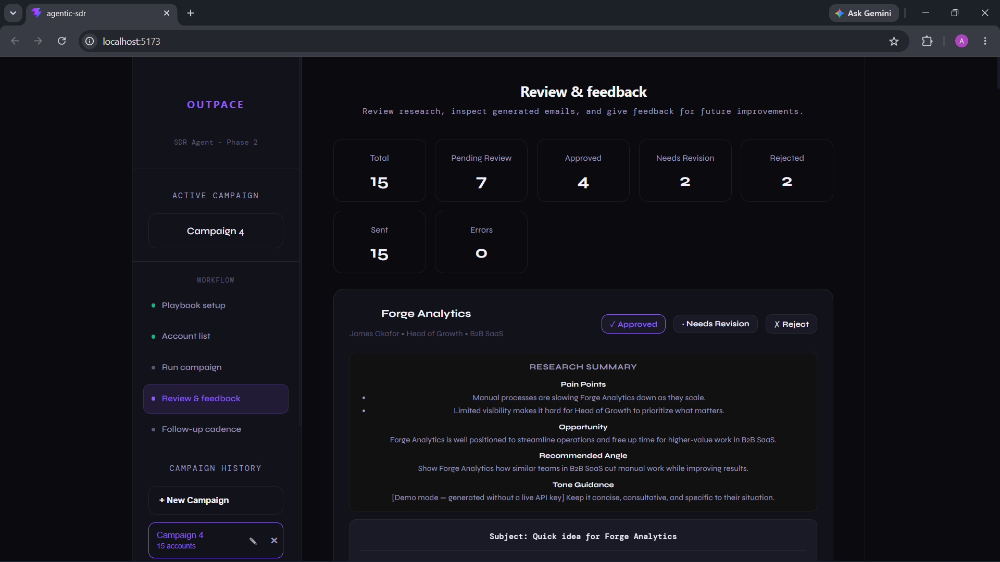
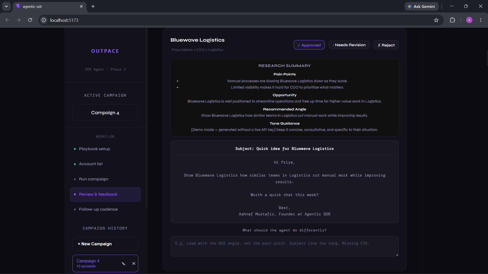

# Outpace — Agentic SDR

**An autonomous outbound sales team, built to run on any salesperson's own proven playbook.**

## Overview

Outpace is an agentic AI system that turns a solo salesperson's proven outbound methodology into a virtual SDR team. Account executives without a dedicated SDR team tend to hit the same ceiling: their research process, email template, and outreach cadence work — they just can't run that process for more hours than exist in a day.

Outpace closes that gap. A sales rep provides their existing playbook — a target account profile, a research guideline, an email template, and an outreach/cadence strategy — and Outpace's agents learn to execute that specific person's methodology autonomously, at a scale one person alone couldn't reach.

## Demo / Screenshots

**Setup**



**Accounts**



**Run**




**Feedback**



## Roadmap: Three Development Phases

**Phase 1 — Guided Execution (foundation)**
Agents are given the rep's research guide and outreach guide. They research a sample list of target accounts, connect each account's needs to what the rep is selling, draft outbound emails following the rep's tested template, and send them automatically.

**Phase 2 — Feedback-Driven Iteration (current phase)**
Agents incorporate the rep's feedback to tweak email drafts over time, autonomously research new accounts added to the target list (not just the original sample), send to those accounts automatically, and run outreach on a defined multi-touch follow-up cadence rather than one-off sends.

**Phase 3 — Full Autonomous Campaign (planned)**
Agents combine everything learned about research and drafting with prospecting itself — finding the right people, not just working an existing list. This phase orchestrates multiple tools: Claude for research documents, Gemini for polishing email copy, LinkedIn Sales Navigator for people search, and Apollo for contact discovery and fit-scoring — running a full outbound campaign end to end with minimal human input.

## Current Status

Actively building **Phase 2**.

- Core pipeline (research → draft → send → cadence) is implemented and running end to end.
- The feedback loop is in place: rep-reviewed edits to past email drafts are used to refine how agents write future ones.
- New-account research and automatic outreach to accounts outside the original sample list is working.
- Outreach cadence (scheduled follow-ups, not just first-touch emails) is implemented.
- Real API keys and live account data are being finalized — the current build has been validated against sample/dummy data while integration work is completed.

## Key Features

- Research automation grounded in a real, human-validated research guideline rather than generic prospecting logic
- Email drafting that mirrors a proven template and voice, not a generic AI-sounding pitch
- A genuine feedback loop, so output quality improves over time instead of staying static
- Multi-touch cadence automation for follow-ups, not just a single send
- Modular design intended to plug in additional tools (Claude, Gemini, Sales Navigator, Apollo) as it grows toward Phase 3
- Built so the underlying playbook is configurable — the same agent pipeline can run a different rep's target profile, research guideline, and template without rebuilding the system

## Tech Stack

- **Backend:** Python
- **API layer:** FastAPI
- **Frontend:** React (Vite)
- **Database:** PostgreSQL
- **Data import/export:** CSV (account lists in, activity/results out)
- **Agent orchestration:** Custom orchestration in the FastAPI backend (direct Python function calls); revisit LangChain/CrewAI only if agent complexity grows in Phase 3
- **LLM provider(s):** Anthropic Claude
- **Email sending:** SendGrid — a cold outreach tool sends at higher volume than personal SMTP allows, and needs deliverability and open/bounce tracking, both of which a personal Gmail/SMTP setup handles poorly
- **Research method:** Claude's native web search tool — since the LLM provider is already Claude, this avoids standing up and paying for a separate search API (SerpAPI, Bing) just for research
- **Cadence/scheduling:** APScheduler — an in-process Python scheduler that needs no extra infrastructure; simple to run follow-up jobs at the current scale, with room to move to Celery + Redis later if volume demands it

## Architecture

```
                     ┌───────────────────────┐
                     │   React Dashboard     │
                     │ (upload lists, review │
                     │  drafts, give feedback)│
                     └──────────┬────────────┘
                                │  REST calls
                                v
                     ┌───────────────────────┐
                     │    FastAPI Backend    │
                     │     (REST API)        │
                     └──────────┬────────────┘
                                │
        ┌───────────────────────┼───────────────────────┐
        v                       v                       v
[ Research Agent ]      [ Drafting Agent ]      [ APScheduler Cadence ]
  Claude + Claude          Claude + Email               triggers follow-up
  web search tool          Template + rep               sends on schedule
        │                  feedback loop
        │                        │
        └──────────────> [ Send Agent ] ───> Outbound Email (SendGrid)
                                │
                                v
                       ┌────────────────┐
                       │  PostgreSQL    │
                       │ (accounts,     │
                       │  drafts, logs, │
                       │  feedback)     │
                       └────────────────┘
```

## Setup & Installation

```bash
# Clone the repo
git clone <repo-url>
cd Outpace

# --- Backend ---
cd backend
python -m venv venv

# activate the venv
source venv/bin/activate       # macOS/Linux
venv\Scripts\Activate.ps1      # Windows PowerShell

pip install -r requirements.txt

# create backend/.env with your Anthropic API key
echo "ANTHROPIC_API_KEY=your-key-here" > .env

# run the API
uvicorn main:app --reload

# --- Frontend --- (in a separate terminal)
cd ../frontend
npm install
npm run dev
```

Data (accounts, drafts, feedback) is currently persisted in the browser's `localStorage` — no database setup is required to run the app today. PostgreSQL is planned for when persistence needs to move server-side (see Roadmap); once that lands, this section will grow a database-setup and migration step.

## Usage

1. Upload a target account list (CSV) through the dashboard.
2. Provide (or confirm) the research guideline, email template, and outreach cadence for this rep.
3. Trigger the pipeline — agents research each account, draft emails, and send them according to the cadence.
4. Review drafts and outcomes in the dashboard; feedback given here feeds back into future drafts (Phase 2 behavior).

Replace this with the real flow once the UI/API surface is finalized — this describes the intended workflow based on the phase spec, not a verified walkthrough.

## Roadmap / What's Next

- Finish wiring in real API keys and live account data to replace sample/dummy data
- Begin Phase 3 groundwork: prospecting integrations (Sales Navigator, Apollo) and multi-model routing (Claude for research, Gemini for polishing)
